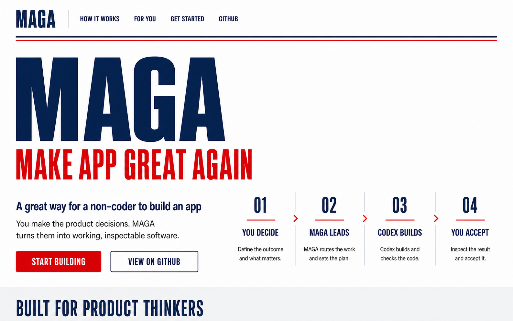
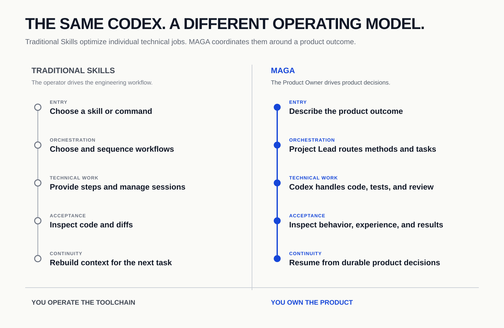

<h1 align="center">MAGA</h1>

<p align="center"><strong>Make Apps Great Again</strong></p>

<p align="center">머릿속에 그린 소프트웨어를 실제로 만드세요.</p>

<p align="center">
  제품 디자이너, 제품 책임자, 처음 소프트웨어를 만드는 사람을 위한 도구입니다.<br>
  제품 판단은 당신이 내리고, MAGA는 그것을 실행하고 확인할 수 있는 소프트웨어로 바꿉니다.
</p>

<p align="center">
  <a href="https://maga.sumimi.jp/"><strong>웹사이트</strong></a> ·
  <a href="./docs/getting-started.ko.md"><strong>시작하기</strong></a> ·
  <a href="./assets/maga-operating-model.svg"><strong>작동 방식</strong></a> ·
  <a href="./LICENSE">MIT License</a>
</p>

<p align="center">
  <a href="./README.md">English</a> ·
  <a href="./README.zh-CN.md">简体中文</a> ·
  <a href="./README.ja.md">日本語</a> ·
  <strong>한국어</strong> ·
  <a href="./README.es.md">Español</a>
</p>

<p align="center">
  <a href="https://maga.sumimi.jp/">
    
  </a>
</p>

MAGA는 제품 담당자가 ChatGPT 데스크톱 앱의 Codex를 사용하기 시작하도록 돕는 전환용 제품 제작 플러그인입니다. 사용자, 문제, 경험, 제약, 트레이드오프를 제품 언어로 설명하면 지속적으로 일하는 Project Lead가 적절한 방법을 선택하고 조사, 프로토타이핑, 구현, 검증, 수정을 조율하면서 그 뒤의 실무 방식을 보여 줍니다.

코드를 이해하거나 Skills를 고르거나 엔지니어링 작업을 관리하거나 코드를 리뷰할 필요가 없습니다. 제품의 동작, 사용 경험, 비즈니스 결과를 보고 승인하면 됩니다.

> [!NOTE]
> MAGA는 시각적 no-code 빌더가 아닙니다. 제품에는 여전히 코드가 있지만 구현 계층은 Codex가 담당합니다. 제품 의도, 우선순위, 제약, 승인 판단은 당신이 유지합니다.

## 두 단계로 시작하기

터미널을 몰라도 됩니다. Codex를 처음 사용한다면 데스크톱 앱 설치부터 첫 결과 승인까지 안내하는 **[완전 초보자 가이드](./docs/getting-started.ko.md)** 를 따라 하세요.

### 1. MAGA 설정하기

1. [ChatGPT 데스크톱 앱](https://learn.chatgpt.com/docs/quickstart?setup=app)을 열고 로그인한 뒤 **Codex** 를 선택합니다.
2. 비어 있는 로컬 프로젝트 폴더를 만들거나 엽니다.
3. 아래 메시지를 Codex에 보냅니다.

> 이 프로젝트에 https://github.com/thevenomsnake/MAGA 의 MAGA 플러그인을 설정해 주세요. 빠진 필수 환경을 확인해 필요하면 설치하고, 이 폴더에서 MAGA를 초기화하거나 복구한 다음 정상 작동을 검증하세요. 이어서 이 제품을 알아볼 수 있는 이름의 Project Lead 작업을 만들거나 재사용하고, 준비되면 정확한 작업 이름을 알려 주세요. 기술 단계는 직접 수행하고 실제 승인이 필요할 때만 저에게 확인하세요.

각 승인 요청을 확인하세요. 설정 중에는 현재 폴더 변경, 지정된 MAGA 저장소를 이 프로젝트나 Codex 플러그인 영역으로 다운로드하는 작업, Codex가 방금 설명한 필수 환경 설치만 허용합니다. GitHub 로그인, 계정이나 저장소 설정, push, Issue 또는 Pull Request 작성은 기본 설정 권한에 포함되지 않습니다. 터미널에 명령을 입력할 필요는 없습니다.

### 2. 제품 시작하기

설치가 끝나면 Codex가 알려 준 **Project Lead 작업**으로 들어가 그곳에서 제품을 설명합니다. 또 다른 제품 설명 예시는 다음과 같습니다.

> MAGA를 제 Project Lead로 사용해 주세요. 독립 디자이너가 고객 피드백을 정리할 수 있는 도구를 만들고 싶습니다. 피드백은 프로젝트별로 보관하고, 어떤 문제가 납품을 막는지 바로 볼 수 있어야 합니다. 저는 코드를 모르니 제품 언어로만 질문하고 제가 직접 확인할 수 있는 작동 결과를 보여 주세요.

이것만으로 시작할 수 있습니다. MAGA는 처음으로 확인할 수 있는 결과를 정하고 제품 방향이나 권한 범위를 바꿀 질문만 합니다.

## Why MAGA

### 왜 래퍼 앱이 아니라 플러그인인가요?

Codex는 이미 어려운 엔지니어링 작업을 수행합니다. 저장소를 이해하고, 코드를 작성·수정하고, 검사를 실행하고, 변경 사항을 리뷰하고, 여러 프로젝트 작업에서 일하고, 재사용 가능한 Skills를 적용할 수 있습니다. OpenAI의 공식 가이드도 같은 발전 경로를 설명합니다. Codex에 지속 가능한 컨텍스트를 제공하고, 반복 작업을 Skills로 만들고, 안정된 기능을 플러그인으로 패키징합니다. 공식 [Codex 모범 사례](https://learn.chatgpt.com/guides/best-practices), [Skills 문서](https://learn.chatgpt.com/docs/build-skills), [플러그인 문서](https://developers.openai.com/plugins/)를 참고하세요.

Codex라는 이름부터 중심이 코드라는 점을 보여 줍니다. 기본 용어와 확장 방식은 작업을 엔지니어링 과제로 설명하고 기술 결과를 검토할 수 있는 사람이 가장 쉽게 활용할 수 있습니다.

제품 담당자는 종종 “기술도 모르면서 지시만 한다”는 말을 듣습니다. 그렇다면 끝까지 지시하세요. MAGA는 제품 목표와 트레이드오프는 당신이 정하고, 코드는 Codex에 맡기도록 해 주는 플러그인입니다.

> **거침없이 지시하고, 책임 있게 승인하세요.**

당신과 Codex 사이에 또 다른 애플리케이션은 필요하지 않습니다. 모델과 클라이언트를 함께 만드는 회사가 둘을 가장 긴밀하게 맞출 수 있습니다. Apple이 자사 칩과 운영체제를 함께 조정하듯 제품 로드맵, 기능 경계, 인터페이스, 출시 주기를 하나로 움직일 수 있기 때문입니다. Codex는 계속 발전합니다. 독립적인 래퍼 앱은 모든 새 기능, 상호작용, 권한 모델을 계속 쫓아가야 합니다. 플러그인은 네이티브 Codex 안에 머물며 지금 부족한 제품 실무만 더하고, 더 이상 필요하지 않을 때 제거할 수 있습니다.

MAGA는 의도적으로 전환용 플러그인으로 설계되었습니다. 제품 담당자가 이미 이해하는 언어와 의사결정에서 시작해 결과 정의, 증거 수집, 제약 설정, 트레이드오프 관리, 작동하는 소프트웨어 승인 같은 제품 제작 실무를 점차 드러냅니다. 목표는 영구적인 의존이 아니라 더 큰 자립입니다. 나중에 Codex를 직접 사용할 수 있어 MAGA가 덜 필요하거나 전혀 필요하지 않게 된다면, 이 플러그인은 제 역할을 다한 것입니다.

MAGA가 존재하는 이유는 모델의 능력과 제품 협업이 서로 다른 문제이기 때문입니다.

일반적인 Skill은 하나의 반복 작업을 안정적으로 만듭니다. 하지만 Skills 모음은 여전히 사용자가 다음에 어떤 작업을 할지, 기술 워크플로를 어떻게 순서화할지, 각 작업에 어떤 컨텍스트가 필요한지, 코드 diff를 어떻게 판단할지 알고 있다고 가정하기 쉽습니다.

MAGA는 그 위에 다음 운영 모델을 추가합니다.

- 제품을 마주하는 하나의 Project Lead가 일상적인 제품 언어를 받습니다.
- 의도 기반 라우팅이 현재 증거에 따라 Skills와 방법을 선택합니다.
- 지속 가능한 프로젝트 상태가 결정, 경계, 역할, 승인된 작업을 보존합니다.
- Product Owner는 코드 리뷰 대신 제품 승인으로 판단합니다.

<p align="center">
  
</p>

## 누구를 위한 것인가

| 현재 역할 | 제공하는 핵심 정보 | MAGA가 담당하는 일 |
| --- | --- | --- |
| 처음 소프트웨어를 만드는 사람 | 해결할 문제, 대상 사용자, 기본 기대 | 필요한 확인과 점검 가능한 결과까지의 경로 |
| 제품 디자이너 | 경험 기준, 정보 구조, 상호작용 트레이드오프 | 조사, 프로토타이핑, 구현, 검증 방법 |
| 제품 책임자 또는 관리자 | 목표, 우선순위, 위험, 자원, 의사결정 범위 | 지속적 컨텍스트, 실행 조율, 실제 결정이 필요한 사안의 제시 |

이미 제품 라인이나 여러 직군이 함께하는 팀을 이끌고 있다면 MAGA를 더 쉽게 사용할 수 있습니다. 가장 중요한 입력인 목표, 우선순위, 경험 기준, 위험 판단, 권한 경계를 이미 가지고 있기 때문입니다. MAGA는 그 역할에 프로그래밍 전문성을 추가로 요구하지 않습니다.

## 작업 계약

| 하지 않아도 되는 일 | 계속 직접 결정하는 일 |
| --- | --- |
| 코드 작성, 읽기, 리뷰 | 제품이 누구의 어떤 문제를 해결하는지 |
| 내부 Skills 또는 엔지니어링 흐름 선택 | 양보할 수 없는 경험과 비즈니스 제약 |
| Tickets 분할, 작업 이름 지정, 엔지니어링 작업 관리 | 우선순위와 허용 가능한 트레이드오프 |
| 테스트 프레임워크 또는 구현 아키텍처 선택 | 동작하는 결과가 제품 문제를 해결하는지 |

코드 리뷰, 테스트, 디버깅, 기술 검증은 계속 수행됩니다. 다만 Product Owner에게 두 번째 전문 직무를 요구하지 않고, Project Lead가 관리하는 엔지니어링 증거가 됩니다.

## 제품을 설명한 뒤 일어나는 일

1. **결과 정렬.** MAGA가 사용자, 문제, 처음 관찰할 수 있는 가치, 제공 형태, 중요한 제약을 파악합니다.
2. **다음 증거 선택.** Project Lead가 확인, 조사, 프로토타입, 구현, 검증, 진단 중 무엇이 필요한지 결정합니다.
3. **가장 작은 점검 가능 단위 제작.** Codex가 구현 선택을 처리하고 실행하거나 보고 검증할 수 있는 결과를 만듭니다.
4. **엔지니어링 작업 확인.** 테스트, 대상이 명확한 리뷰, 진단으로 기술적 타당성을 확인합니다.
5. **제품 판단으로 복귀.** 당신이 동작과 경험을 평가하고 다음 결정을 제품 언어로 설명합니다.

예를 들면:

```text
아직 작업 관리 도구처럼 보입니다. 먼저 이번 주에 무엇이 바뀌었는지 보여주고,
그 변화에서 담당자를 찾아갈 수 있게 하고 싶습니다.
```

이 피드백은 정보 구조와 다음 구현을 바꿉니다. 컴포넌트 이름이나 코드 줄을 지정할 필요가 없습니다.

## MAGA가 기록하는 것

1. **의도:** 사용자, 문제, 기대 결과, 제약.
2. **라우팅:** 다음 단계가 확인, 조사, 설계, 구현, 검증, 수정 중 무엇인지.
3. **상태:** 승인된 결정, 열린 질문, 진행 중인 작업, 다음으로 유용한 결과.
4. **권한:** 승인된 행동과 새로운 결정이 필요한 행동.
5. **증거:** 프로토타입, 실제 동작, 테스트, 진단, 제품 승인.

이 정보는 프로젝트에 저장됩니다. 새로 만들거나 복구한 Project Lead 작업은 하나의 작업 기록을 제품 기록으로 취급하지 않고 지속 상태에서 이 정보를 읽을 수 있습니다.

## 제품 및 권한 경계

MAGA는 승인된 작업을 자율적으로 진행하지만 하나의 자연어 요청을 무제한 권한으로 확대하지 않습니다.

- 지정된 프로젝트 안의 되돌릴 수 있는 작업과 위험 수준에 맞는 검사는 일반 실행에 해당합니다.
- 배포, 결제, 계정 작업, 외부 메시지, 되돌릴 수 없는 삭제에는 명시적 권한이 필요합니다.
- 기존 결정에서 추론할 수 없는 제품 트레이드오프는 Product Owner에게 돌아갑니다.
- ChatGPT 데스크톱 앱의 Codex가 계속 사용자 인터페이스이며 MAGA는 별도 대시보드를 만들지 않습니다.

## 책임별 모델 설정

MAGA는 기능 하나가 아니라 완전한 애플리케이션 규모로 일하지만, 그 애플리케이션이 거대한 플랫폼일 필요는 없습니다. 목표가 분명한 제품을 의도에서 작동하는 첫 출시까지 가져가는 데 필요한 일을 조율합니다. 아래 일곱 이름을 직무처럼 익히거나 일곱 팀을 직접 관리할 필요는 없습니다. MAGA가 일을 나누기 위해 사용하는 내부 라벨입니다.

### 작지만 완결된 첫 출시로 일곱 책임 이해하기

관심사 커뮤니티를 위한 작은 소식 공유 앱을 만들어 출시한다고 생각해 보세요. 사용자는 가입하고, 이름과 짧은 프로필을 입력하고, 짧은 소식을 게시하고, 홈 타임라인에서 커뮤니티의 최신 게시물을 보고, 답글을 달 수 있습니다. 기존 제품에 기능 하나를 더하는 일도, 한 번에 거대한 소셜 플랫폼을 만드는 일도 아닙니다. 실제 핵심 사용 흐름을 갖추고 사용자에게 건넬 수 있는, 작지만 완결된 첫 출시입니다.

- **Project Lead (`project-lead`) — 제품 전체를 앞으로 이끕니다:** 제품 방향을 명확한 범위와 승인 기준으로 정리합니다. 예를 들어 “가입 → 프로필 → 게시 → 홈 타임라인 → 답글” 흐름을 완성하도록 정한 뒤 조사, 프로토타입, 구현, 검증을 조율합니다. 대상 사용자나 경험 방향을 바꾸는 결정은 계속 사용자가 내립니다.
- **조사 (`research`) — 제품 결정을 위한 근거를 찾습니다:** 관심사 커뮤니티가 지금 어떻게 소통하는지, 현재 경험이 어디서 부족한지, 구성원이 프로필, 짧은 게시물, 홈 타임라인, 답글에서 실제로 무엇을 기대하는지 알아보며 추측만으로 제품을 설계하지 않게 합니다.
- **프로토타입 (`prototype`) — 전체 구축 전에 제품을 보고 써 볼 수 있게 합니다:** 가입, 프로필, 게시, 홈 타임라인, 답글을 직접 조작할 수 있는 버전을 만들어 정보와 순서를 확인하고 핵심 사용 흐름이 성립하는지 판단하게 합니다.
- **전달 (`delivery`) — 승인한 경험을 실제 제품으로 바꿉니다:** 프로토타입을 작은 단위로 작동하는 애플리케이션으로 구현해 계정, 프로필, 게시물, 답글이 화면이나 시연에만 머물지 않고 실제로 저장되고 올바르게 연결되도록 합니다.
- **진단 (`diagnosis`) — 실제 장애가 시작된 곳을 찾습니다:** 새 게시물이 홈에 나타나지 않거나, 새로고침 뒤 내용이 사라지거나, 답글이 잘못된 위치에 나타나면 제품을 무작정 다시 만들지 않고 동작을 재현해 실제 원인을 분리합니다.
- **리뷰 (`review`) — 완전성과 신뢰성을 독립적으로 확인합니다:** 가입부터 게시, 탐색, 답글까지 전체 여정을 따라가며 결과를 사용자의 요구와 비교하고, 계정 정보와 커뮤니티 콘텐츠에 필요한 접근성, 개인정보 보호, 안전의 기본 경계가 있는지 확인합니다.
- **릴리스 (`release`) — 실제 사용자에게 제품을 안정적으로 전달합니다:** 운영 환경 설정, 백업, 운영 상태를 확인하는 방법, 문제가 생겼을 때 되돌리는 경로가 준비됐는지 확인합니다. 사용자가 출시를 승인한 뒤 제품을 공개하고, 새 사용자가 핵심 여정 전체를 완료할 수 있는지 검증합니다.

모델을 설정하는 일은 일곱 명을 고용하거나 관리하는 일이 아닙니다. 보이지 않는 각 작업에 어느 정도의 판단력과 추론 능력을 사용할지 정하는 것입니다. 책임 선택, 작업 라우팅, 조율은 계속 MAGA가 담당합니다.

| 책임 | Pro · 품질 우선 | Plus · 일반 사용 | Free / Go · 사용량 절약 |
| --- | --- | --- | --- |
| Project Lead (`project-lead`) | Sol · xhigh | Sol · xhigh | Terra · xhigh |
| 조사 (`research`) | Sol · max | Sol · max | Terra · max |
| 프로토타입 (`prototype`) | Sol · xhigh | Terra · high | Terra · high |
| 전달 (`delivery`) | Terra · xhigh | Luna · max | Luna · max |
| 진단 (`diagnosis`) | Sol · max | Terra · xhigh | Terra · high |
| 리뷰 (`review`) | Sol · xhigh | Sol · high | Terra · high |
| 릴리스 (`release`) | Sol · xhigh | Sol · high | Sol · high |

Business, Enterprise, Edu 워크스페이스는 Plus 구성으로 시작한 뒤 사용량과 정책이 허용하면 Pro를 사용할 수 있습니다. API key 사용자는 token 예산에 맞춰 선택하세요. **Sol** 은 모호함, 판단, 완성도에, **Terra** 는 추론과 도구 사용이 필요한 일상 작업에 사용합니다. **Luna** 는 완료 기준이 명확한 전달에만 **max** 로 추천합니다. 적용 후에도 각 항목을 바꿀 수 있습니다.

변경하려면 MAGA 플러그인 상세 페이지에서 **Configure** starter prompt를 선택하세요. MAGA 작업이 시작되고 작업 안에서 설정 패널이 열립니다. 현재 Codex 플러그인 상세 페이지는 임의의 사용자 지정 양식을 넣을 수 없으므로 패널 자체가 상세 페이지에 내장되는 것은 아닙니다. 처음 **Save**를 누르면 설정이 활성화되고 일곱 책임 전체가 하나의 완전한 설정으로 고정됩니다. 설정은 현재 Codex Home에 저장되며 제품 저장소나 Git 기록에는 들어가지 않습니다.

저장된 설정은 그 이후 명시적으로 새로 만드는 작업에만 적용되며 기존 작업은 바뀌지 않습니다. Project Lead도 새로 만들 때만 이 설정을 사용합니다. 기존 Project Lead가 새 설정으로 이어받게 하려면 “새 설정으로 이어받아 줘”라고 명시하고 대체 작업 생성을 승인해야 합니다.

MAGA는 작업의 책임과 저장된 설정을 자동으로 판단하지만, Codex 새 작업을 만들기 전에는 제품 언어로 명시적 동의를 요청합니다. 이름이 정해진 작업 여러 개를 한 번에 승인할 수도 있습니다. 설정 패널의 독립적인 `model/list`는 참고용 목록일 뿐 작업을 실행할 대상 호스트의 최종 기준이 아닙니다. MAGA는 사용자가 명시적으로 저장한 `model`과 `thinking`을 새 작업의 대상 호스트에 전달하고 그곳에서 최종 검증합니다. 대상 호스트가 거부할 때만 overrides를 빼고 한 번 다시 시도하며, 호스트 기본값을 사용했다는 사실을 명확히 알립니다. 작업이 단지 “어려워 보인다”는 이유로 모델을 몰래 상향하지도 않습니다.

## 구성

현재 릴리스는 **v0.13.0**입니다. 등록된 Skills 18개, 필요할 때만 로드하는 내부 방법 라이브러리, 제품 책임자가 확인하는 Bar Tester 프로필, 로컬 파일의 사람이 읽는 텍스트에 대한 Humanization 자동 라우팅을 포함합니다.

| 계층 | 책임 |
| --- | --- |
| Project Lead | 제품 언어 수신, 상태 유지, 방법 선택, 작업 조율 |
| Bar Tester | 실제 사용에서 출발해 ‘술을 몇 잔 주문하는가’만 망라하다가 실제 사용자의 ‘볶음밥 주문’을 놓치지 않고, 사용자 범위·노출·전달 방식·규모에 맞춰 검증함 |
| 제품 발견 | 확인, 조사, 도메인 언어, 개념, 우선순위 |
| 설계와 전달 | 계획, 프로토타이핑, 구현, 검증, 완료 |
| 콘텐츠 자연화 | 6개 로케일의 기사, 문서, 메시지, 제품 및 GUI 문구를 자연스럽게 다듬음 |
| 진단과 단순화 | 디버깅, 코드 리뷰, 불필요한 복잡성 제거 |
| 방법 라이브러리 | 매 작업의 컨텍스트를 차지하지 않도록 상위 워크플로를 필요할 때만 로드 |

Humanization은 로컬 파일이라는 결정적인 경계를 사용합니다. MAGA가 Markdown이나 다른 문서, 보고서, 기사, 저장되는 커뮤니케이션 초안, 릴리스 노트, 소스 또는 리소스 파일의 제품 표시 문구처럼 사람이 읽는 텍스트를 로컬 파일에 쓰거나 수정할 때만 자동 적용됩니다. 채팅으로만 반환되는 텍스트는 길이, Markdown 표시, 복사 가능 여부, 향후 공유 가능성과 관계없이 자동 적용되지 않습니다. 명시적 호출은 계속 가능하며 자동 실행은 알리지 않습니다.

구현 살펴보기: [Skill catalog](./plugins/maga/skill-catalog.json) · [Project Lead](./plugins/maga/skills/project-lead/SKILL.md) · [제품 중심 Project Lead](./playbooks/product-oriented-project-lead.md)

<details>
<summary><strong>라우팅, 작업, 권한</strong></summary>

### 라우팅

Project Lead는 먼저 필요한 증거의 종류를 파악한 뒤 등록된 Skill 또는 내부 방법을 선택합니다. 사용자가 Skill을 명시적으로 호출할 수 있지만 일반적인 제품 작업에는 필요하지 않습니다.

### 작업 경계

기본적으로 현재 작업에서 계속 진행합니다. 병렬 실행, 분리된 컨텍스트, 별도 권한 경계, 독립 승인이 필요한 구체적인 대상이 있을 때만 별도 작업을 만듭니다. 비어 있는 조사, 프로토타입, 구현, 리뷰 공간을 미리 만들지 않습니다.

### 권한

자연어 승인은 명확히 설명된 현재 제품 단위에 적용됩니다. 이후 Tickets나 크게 확장된 결과까지 자동으로 승인하지 않습니다.

자세히 보기: [Capability routing](./plugins/maga/skills/project-lead/references/capability-routing.md) · [Native Codex loop](./plugins/maga/skills/project-lead/references/native-codex-loop.md) · [Project memory](./plugins/maga/skills/project-lead/references/project-memory.md)

</details>

<details>
<summary><strong>설치 동작</strong></summary>

`install`은 MAGA marketplace를 추가하거나 업데이트하고 `maga@maga`를 설치합니다.

`init`은 빈 디렉터리를 받아 다음을 수행합니다.

1. 플러그인을 설치합니다.
2. `.ai-workflow/PROJECT.md`, `AGENTS.md`, `.gitignore`를 작성합니다.
3. Git을 초기화하고 사용자 정보가 설정되어 있으면 첫 커밋을 만듭니다.
4. 이름이 명확한 Project Lead 작업을 만들거나 재사용합니다.
5. ChatGPT 데스크톱 앱의 Codex에서 프로젝트를 엽니다.

`start`는 기존 프로젝트 상태를 읽고 프로젝트 파일을 다시 쓰지 않은 채 Project Lead를 복구합니다. 이 내용은 유지관리자를 위한 세부 정보이며 일반 사용자는 Codex에 설정, 복구, 제거를 요청하면 됩니다.

</details>

## 상위 프로젝트와 라이선스

MAGA는 고정된 리비전의 검증된 방법을 적용합니다.

- [mattpocock/skills](https://github.com/mattpocock/skills): 공식 Engineering 및 Productivity Skills 25개의 워크플로 자료. `8b36d4f`에 고정.
- [DietrichGebert/ponytail](https://github.com/DietrichGebert/ponytail): 최소 구현, 복잡성 리뷰, 라이프사이클 Hooks. `16f2980`에 고정.
- [thevenomsnake/humanization](https://github.com/thevenomsnake/humanization): 6개 로케일의 자연스러운 산문 및 GUI 문구. `d3b8f37`(Humanization `3.0.0`)에 고정.

라우팅, 프로젝트 상태, 설치 프로그램, Project Lead 계약은 MAGA의 로컬 적용입니다. 출처, 변경 사항, 라이선스는 [THIRD_PARTY_NOTICES.md](./THIRD_PARTY_NOTICES.md)에 기록되어 있습니다.

## 조사와 플레이북

- [조사 인덱스](./research/README.md)
- [제품 중심 Project Lead](./playbooks/product-oriented-project-lead.md)
- [다중 작업 협업](./playbooks/multi-session-collaboration.md)
- [Codex 기본 Ticket 오케스트레이션](./playbooks/codex-ticket-orchestration.md)
- [AI-slop 조사](./research/kill-ai-slop.md)

## License

MAGA는 [MIT License](./LICENSE)로 공개됩니다. 타사 자료에는 각 라이선스가 적용됩니다. 자세한 내용은 [THIRD_PARTY_NOTICES.md](./THIRD_PARTY_NOTICES.md)를 참고하세요.
