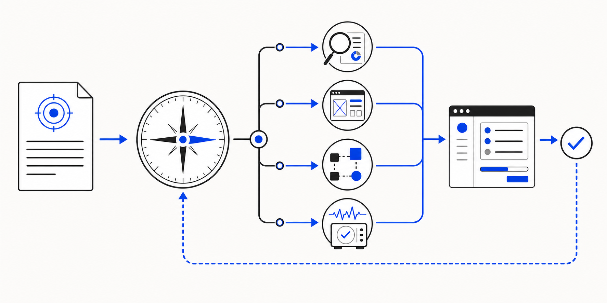
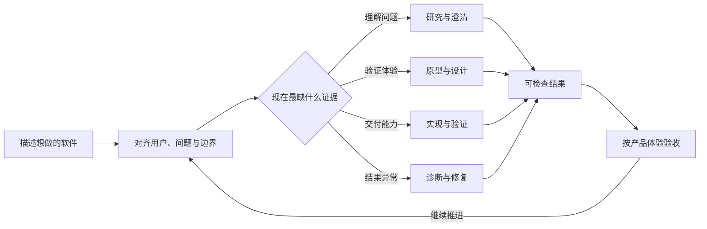

<h1 align="center">MAGA</h1>

<p align="center"><strong>Make Apps Great Again</strong></p>

<p align="center">把你心目中的软件做出来。</p>

<p align="center">
  面向产品设计者、产品负责人和第一次做软件的人。<br>
  你负责产品判断；MAGA 负责把判断转成可运行、可检查、可继续推进的软件。
</p>

<p align="center">
  
</p>

<p align="center"><sub>产品意图 → Project Lead 路由 → 研究 / 原型 / 构建 / 诊断 → 可验收软件</sub></p>

MAGA 是一个运行在 Codex Desktop 中的产品构建工作流。你用自然语言描述用户、问题、体验和取舍；一个持续工作的 Project Lead 会选择合适的方法，组织研究、原型、实现、验证和修复。

你不需要了解代码，不需要记住 Skill 名称，也不需要阅读或 review 代码。你验收的是产品行为、使用体验和业务结果。

> [!NOTE]
> MAGA 不是可视化 no-code 平台。软件仍然由代码构成，但代码属于执行层，由 Codex 负责处理；产品意图和验收标准仍由你掌握。

## 现在开始

需要 [Codex Desktop](https://openai.com/codex/)、可用的 Codex CLI、Node.js 18 或更高版本，以及 Git。若不希望初始化 Git，可以在命令后加 `--no-git`。

```bash
npx github:thevenomsnake/MAGA init ./my-product
```

打开新项目后，直接描述你想做的软件：

```text
我想做一个帮助独立设计师整理客户反馈的工具。
反馈要能按项目归档，并且让我一眼看出哪些问题正在阻塞交付。
```

MAGA 会先确认真正影响方向的问题，再决定下一步应该研究、澄清、做原型、实现，还是检查已有结果。你不需要先把需求改写成技术任务。

已有项目可以只安装插件：

```bash
npx github:thevenomsnake/MAGA install
```

`install` 会添加或更新 MAGA marketplace，并把插件安装到 Codex。`init` 还会在一个空目录中写入持久项目状态和协作规则，初始化 Git，创建并固定 Project Lead 任务，然后在 Codex Desktop 中打开项目。

回到已经初始化的项目时，可以恢复或重新创建它的 Project Lead：

```bash
npx github:thevenomsnake/MAGA start ./my-product
```

## 为什么需要 MAGA

许多 Agent Skills 默认操作者已经理解工程阶段：什么时候写规格、什么时候拆任务、什么时候 review、什么时候调试。对开发者来说，这很直接；对负责产品结果的人来说，这些只是实现过程。

MAGA 改变的是协作界面：

| 传统的工程入口 | MAGA 的产品入口 |
| --- | --- |
| 选择命令或 Skill | 描述目标、用户和限制 |
| 先拆实现任务 | 先判断当前最缺的证据 |
| 阅读代码确认进展 | 体验可运行或可检查的结果 |
| 手动维护工作状态 | 自动保留决定、边界和下一步 |

产品仍然需要清楚的判断，只是不再要求判断者同时扮演工程项目经理。

## 谁会用得顺手

| 你现在的位置 | 你带来的关键输入 | MAGA 承担的工作 |
| --- | --- | --- |
| 第一次做软件 | 想解决的问题、目标用户、基本期望 | 补齐必要问题，把想法推进成可检查结果 |
| 产品设计者 | 体验标准、信息结构、交互取舍 | 选择研究与原型方法，并把设计意图落实到产品 |
| 产品负责人或管理者 | 目标、优先级、风险、资源与决策边界 | 维持工作上下文，组织执行，暴露真正需要拍板的事项 |

如果你已经负责一条产品线或跨职能工作，MAGA 往往更容易使用。因为你已经拥有最重要的输入：知道什么值得做、什么不能牺牲、什么结果可以接受。它不要求你再补上一套代码能力。

## 你负责什么

| 你不需要做 | 你仍然决定 |
| --- | --- |
| 编写、阅读或 review 代码 | 产品应该为谁解决什么问题 |
| 选择内部 Skill 和工程流程 | 哪些体验和业务约束不能妥协 |
| 拆 Ticket、命名任务、管理会话 | 当前优先级和可接受的取舍 |
| 判断测试框架或实现架构 | 可运行结果是否真的解决了问题 |

代码检查、测试、调试和针对性 review 仍然会发生，只是它们成为 Project Lead 管理的工程证据，而不是要求你亲自处理的界面。

## 一条产品路径，而不是一组命令



Project Lead 持续维护同一条工作主线，只在出现真正的阻塞、并行执行或需要独立验收的边界时创建新任务。研究、原型、实现和修复是内部方法，不是要求用户学习的菜单。

## 一次协作会怎样进行

假设你提出：

```text
我想把团队的每周产品复盘做成一个轻量工具。
大家不应该先填一张复杂表格，但我需要看见决定、风险和负责人。
```

MAGA 会按当前证据推进：

1. 识别目标用户、关键场景和不能牺牲的体验。
2. 只询问会改变方向或授权边界的问题。
3. 选择需要的研究、原型或实现方法。
4. 交付可查看、可运行或可验证的结果，而不只是一份计划。
5. 记录已确认的决定、开放问题和下一步，让后续会话从当前状态继续。

你可以用产品语言反馈：

```text
列表太像任务管理器了。我更想先看到这周发生了什么变化，再追到负责人。
```

这类反馈会改变信息架构和下一步执行。你不需要指出组件文件或代码行。

## MAGA 管理的五件事

1. **意图**：用户、问题、期望结果和约束。
2. **路由**：当前应该澄清、研究、设计、实现、验证还是修复。
3. **状态**：已经确认的决定、仍然开放的问题和下一步。
4. **授权**：哪些动作已被明确允许，哪些需要再次确认。
5. **证据**：原型、运行结果、测试、诊断和产品验收。

这些信息保存在项目中，因此换一次会话不等于重新开始。

## 产品边界

MAGA 可以在明确范围内自主推进，但不会把一句自然语言扩张成无限授权。

- 创建或修改项目内容、运行必要检查，属于正常执行。
- 发布、付费、账户操作、外部消息和不可逆删除，需要明确授权。
- 影响方向但无法从现有上下文判断的产品取舍，会交还给你决定。
- Codex Desktop 是主要交互界面；MAGA 不要求你再维护一套并行仪表盘。

## 里面有什么

当前版本是 **v0.9.0**，包含 15 个注册 Skills 和一套按需读取的方法库。

| 层 | 作用 |
| --- | --- |
| Project Lead | 接收自然语言、维护项目状态、选择方法并管理任务 |
| 产品发现 | 访谈、问题定义、机会识别、概念与优先级判断 |
| 设计与构建 | 规划、原型、前端实现、验证与收尾 |
| 诊断与简化 | 系统化调试、代码审查、削减过度工程 |
| 方法库 | 仅在需要时加载的上游工作流材料，避免一次塞入全部上下文 |

查看完整目录：[Skill catalog](./plugins/maga/skill-catalog.json) · [Project Lead](./plugins/maga/skills/project-lead/SKILL.md) · [产品构建说明](./playbooks/product-oriented-project-lead.md)

<details>
<summary><strong>查看路由、任务与授权机制</strong></summary>

### 两层路由

Project Lead 先判断工作属于产品发现、设计、实现、验证还是修复，再从对应类别中选择具体方法。用户不需要命名内部 Skill；显式指定时也可以直接调用。

### 任务边界

默认在当前任务继续工作。只有出现以下情况之一才会创建新任务：需要并行执行、需要隔离长时间工作、需要独立验收或需要明确交接。任务标题由产品域、工作类型和目标组成，便于回到项目时理解上下文。

### 授权边界

Project Lead 区分项目内可逆执行与外部、高成本或不可逆动作。自然语言中的范围和约束会成为执行依据；没有证据的扩张不会被视为默认许可。

进一步阅读：[能力路由](./plugins/maga/skills/project-lead/references/capability-routing.md) · [原生 Codex 循环](./plugins/maga/skills/project-lead/references/native-codex-loop.md) · [项目记忆](./plugins/maga/skills/project-lead/references/project-memory.md)

</details>

<details>
<summary><strong>查看安装行为</strong></summary>

`install` 会检查 MAGA marketplace：已经存在时更新，不存在时添加，然后安装 `maga@maga` 插件。

`init` 只接受空目录，并依次完成：

1. 安装插件。
2. 写入 `.ai-workflow/PROJECT.md`、`AGENTS.md` 和 `.gitignore`。
3. 初始化 Git；存在身份配置时创建第一次提交。
4. 创建或复用一个命名明确的 Project Lead 任务。
5. 打开 Codex Desktop 中的项目。

`start` 不改写项目内容，只读取已有项目状态并恢复 Project Lead。完整参数可通过 `npx github:thevenomsnake/MAGA --help` 查看。

</details>

## 上游工作与许可

MAGA 在固定版本上整合了两类成熟方法：

- [mattpocock/skills](https://github.com/mattpocock/skills)：22 个正式 Engineering 与 Productivity Skills 的工作流材料，固定到 `2ab9580`。
- [DietrichGebert/ponytail](https://github.com/DietrichGebert/ponytail)：简化实现与审查复杂度的方法和生命周期 Hooks，固定到 `16f2980`。

MAGA 自己的路由、状态管理、安装流程和 Project Lead 语义属于本项目。完整来源、修改说明与许可证见 [THIRD_PARTY_NOTICES.md](./THIRD_PARTY_NOTICES.md)。

<details>
<summary><strong>版本记录</strong></summary>

| 版本 | 重点 |
| --- | --- |
| 0.1.0 | 建立插件与 Project Lead 主入口 |
| 0.2.0 | 引入按需产品方法库 |
| 0.3.0 | 增加初始化命令与产品蓝图 |
| 0.4.0 | 收紧任务创建与会话恢复规则 |
| 0.5.0 | 加入运行方式、授权语义与 Hooks |
| 0.6.0 | 增加整合验证和文档边界 |
| 0.7.0 | 扩展运行时路由、验收与上游归因 |
| 0.8.0 | 完成 AI-slop 研究与设计检查方法 |
| 0.9.0 | 统一项目入口、方法目录与 Project Lead 语义 |

</details>

## 研究与手册

MAGA 同时维护可复用的协作研究：

- [研究索引](./research/README.md)
- [面向产品构建者的 Project Lead](./playbooks/product-oriented-project-lead.md)
- [多会话协作](./playbooks/multi-session-collaboration.md)
- [Codex 原生 Ticket 编排](./playbooks/codex-ticket-orchestration.md)
- [AI-slop 研究](./research/kill-ai-slop.md)

## License

MAGA 采用 [MIT License](./LICENSE)。第三方内容遵循各自许可证，详见 [THIRD_PARTY_NOTICES.md](./THIRD_PARTY_NOTICES.md)。
