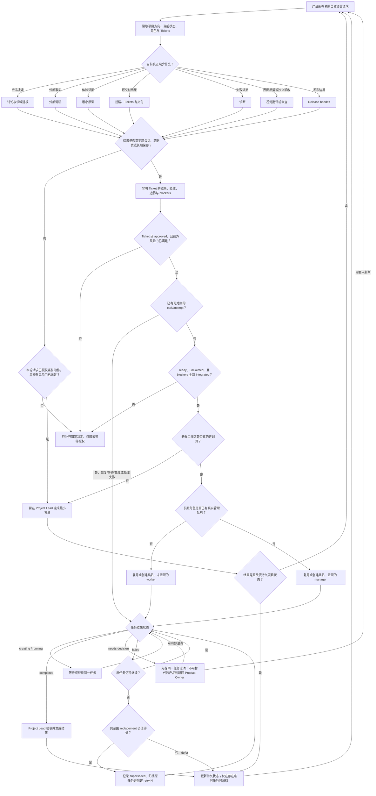

# MAGA

<p align="center">
  
</p>

**Make Apps Great Again → MAGA**

让资深产品构建者只负责产品判断，让 Codex 管理工程工作方式。

MAGA 是一个独立、开源、实验性的 Codex 插件与项目初始化器。
它面向懂产品、体验和基本软件边界，但不希望亲自管理 Skill 命令、会话编排、
Ticket 格式、Git 流程和工程角色的产品设计者与产品负责人。

用户始终从一个置顶的 **Project Lead（产品主理）** 开始。Project Lead 会在
目标具体后，按需创建带明确对象的外部调研、原型验证、诊断、审查或交付任务，
整合结果后再归档。初始化不会生成一排空的“部门窗口”。

> 当前版本：`0.8.0`。这是公开实验，不是成熟度认证，也不是任何上游项目的
> 官方发行版。

## 一分钟开始

### 只安装插件

在要使用 MAGA 的 Codex 环境中运行：

```powershell
npx github:thevenomsnake/MAGA install
```

这条命令只添加 MAGA marketplace 并安装插件，不创建项目、不初始化 Git、
不启动 Codex。适合先在现有项目或隔离实例中试用 Skills。

### 初始化一个新项目

在空文件夹中运行：

```powershell
npx github:thevenomsnake/MAGA init
```

也可以指定一个新的空目录：

```powershell
npx github:thevenomsnake/MAGA init ./my-product
```

初始化器会：

1. 安装 MAGA 插件；
2. 创建最小的 `.ai-workflow/PROJECT.md` 与项目级 `AGENTS.md`；
3. 初始化 Git，并在本机已配置 Git 身份时创建首个提交；
4. 通过一次性 Codex App Server bridge 创建、命名并置顶 Project Lead；
5. 打开项目，然后退出 bridge，不常驻后台。

私有仓库安装需要本机 Git 已具备对应 GitHub 访问权限。初始化器只接受空目录，
不会接管或重写一个已有项目。

## 用户只需要说产品语言

例如：

```text
我想做一个帮助独立设计师管理客户反馈的工具。
```

也可以直接说：

- 帮我把这个产品想法讨论清楚；
- 先调研这个市场、竞品或外部限制；
- 做一个最小原型验证这个交互；
- 继续推进当前项目；
- 这个结果不符合预期，先找出原因。

默认路径不要求用户输入 `$to-spec`、`$research`、`$prototype` 或其他 Skill
命令。希望精确控制原始工作流的高级用户，仍然可以显式使用插件内保留的
Matt Pocock Skills 和 Ponytail 入口。

## 自动路由如何工作

MAGA 不是靠一组固定关键词把用户塞进预设流水线。它使用两层路由：

1. **Codex 宿主层**：Codex 根据 Skill 的 `description` 判断是否隐式加载
   `project-lead`、Matt 原本允许自动调用的 Skills 或 Ponytail Skills。隐式匹配
   是模型判断，不是关键词规则，也不保证每一种说法都命中。
2. **MAGA 项目层**：Project Lead 被加载后，结合用户本轮意图与仓库中的
   `AGENTS.md`、`.ai-workflow/PROJECT.md`、角色、决策和 Ticket 状态，判断当前
   缺的是产品决定、外部事实、体验证据、实现、诊断还是验收，再选择内部方法和
   注意力工作区。

这里有三种容易混淆、但实际不同的“自动”：

| 机制 | 什么时候发生 | 不代表什么 |
| --- | --- | --- |
| 宿主隐式调用 | 用户表述与一个允许隐式调用的 Skill `description` 匹配时，Codex 可能加载它 | 不是每条消息都读取全部 30 个 `SKILL.md` 正文，也不是确定性关键词命中 |
| Project Lead 内部路由 | `project-lead` 已进入后，项目证据表明需要某种方法时，它选择已打包说明并决定留在当前任务还是拆出工作区 | 不会修改 Matt 的原始调用元数据，也不会让一个未授权 Ticket 获得执行权 |
| Ponytail 生命周期注入 | 用户已信任 hooks、宿主启用 hooks 且 Node.js 18+ 可用时，在启动、恢复、清空、压缩、模式切换和子任务开始等事件发生 | 不是一次新的产品任务路由；任一运行条件不满足时都不会自动注入 |

具体注册与触发范围如下：

- **`project-lead`**：当用户要求构建、修改、继续或恢复一个产品或多步骤项目，并
  期待 Codex 管理工程过程时，允许宿主隐式调用。一个自包含事实问题或很窄的代码
  修改明确排除在外。
- **`orchestrate-tickets`**：不是普通用户入口。Project Lead 在完整、已批准的
  持久 Ticket 需要协调、恢复、等待、集成或 fresh workspace，或长期角色需要
  manager 时进入；协调工具必须可用。它先对账现有任务。只有没有可复用任务、
  确实要新 dispatch 时，才额外要求 Ticket 为 `ready`、未被领取、全部 blockers
  已 `integrated`，而且新工作区比当前任务更合算。
- **Matt 的 9 个隐式入口**：`prototype`、`diagnosing-bugs`、`research`、`tdd`、
  `domain-modeling`、`codebase-design`、`code-review`、
  `resolving-merge-conflicts`、`grilling`。MAGA 项目额外规定：除非用户明确要求，
  普通交付不默认采用 TDD。
- **Matt 的 13 个显式入口**：`ask-matt`、`grill-with-docs`、`triage`、
  `improve-codebase-architecture`、`setup-matt-pocock-skills`、`to-spec`、
  `to-tickets`、`implement`、`wayfinder`、`grill-me`、`handoff`、`teach`、
  `writing-great-skills`。Codex 宿主不会因普通自然语言直接隐式加载这些原入口；
  高级用户可以显式选择。Project Lead 也可以在 MAGA 自己的授权与项目边界内，
  把相应说明作为内部方法采用——这是 MAGA 的编排，不是 Matt 上游自动调用。
- **Ponytail 的 6 个隐式入口**：`ponytail`、`ponytail-review`、
  `ponytail-audit`、`ponytail-debt`、`ponytail-gain`、`ponytail-help`。其中主
  `ponytail` 还可通过已信任 hooks 在生命周期中持续注入最小化策略；其余入口仍
  只在意图匹配时加载。

因此，路由判断本身由模型完成，但执行边界不是任意的：Ticket 授权、项目状态与
外部副作用构成状态门禁；确定性任务名称和归档规则让恢复行为可检查。实际契约
分布在 [能力与工作区路由](plugins/maga/skills/project-lead/references/capability-routing.md)、
[项目记忆](plugins/maga/skills/project-lead/references/project-memory.md)、
[原生 Codex 闭环](plugins/maga/skills/project-lead/references/native-codex-loop.md)
和 [Ticket 编排](plugins/maga/skills/orchestrate-tickets/SKILL.md)。每个上游
入口的用途与自然语言示例见
[Matt Pocock Skills 与 Ponytail 使用手册](playbooks/matt-skills-and-ponytail-guide.md)。



### Project Lead 完整路由表

| 识别到的信号 | MAGA 选择的方法 | 默认工作区 | 何时不会进入该路由 |
| --- | --- | --- | --- |
| 用户、问题、首个价值或行为仍有实质歧义 | 讨论、grilling、领域建模；一次只问一个产品问题 | 当前 Project Lead | 已知信息足以形成可检查结果时不继续访谈 |
| 一个外部事实可能改变产品决定 | 基于主要或权威来源的 research | 问题较小则当前任务；问题有边界且足够实质，并需要独立产物、不同上下文或注意力隔离时才新建调研任务 | 仅为了“看起来研究充分”不调研；来源多本身也不足以拆任务 |
| 交互、状态或业务规则必须亲自体验才能判断 | 回答一个明确问题的最小 prototype | 有独立可体验产物时新建原型任务 | 能通过对话或已有界面直接决定时不做原型 |
| 目标清楚，但路线大到一个注意力窗口无法容纳 | wayfinding 方法，把未知项拆成决策问题 | 只为具体决策建立任务 | 工作已清楚且可在一个 Ticket 内完成时不建立地图 |
| 关键决定已经闭合 | 综合当前讨论形成规格 | 默认当前 Project Lead | 仍有阻塞产品决定时不假装规格已经稳定 |
| 结果需要跨会话、跨职责或长期保存 | 建立面向用户结果的 MAGA Tickets | 先写入仓库状态，不一定创建新任务 | 几分钟内可在当前聚焦任务完成时不制造 Ticket 仪式 |
| 完整 Ticket 已 `authorization: approved`，需要执行或恢复 | 最小实现或对应专业交付方法 | 先恢复匹配任务；留在当前任务也更便宜时直接完成。只有新 dispatch 才要求 `ready`、unclaimed、全部 blockers 已 `integrated` | `pending`、`revoked` 或范围实质扩大时不产生新副作用；已有 active/completed 任务时不重复投递 |
| 已观察到具体失败 | 先 diagnosis：建立复现或证据链，再决定最小修复 | 小问题留当前任务；长证据链或隔离环境才新建诊断任务 | 没有已观察症状时不凭猜测进入修复 |
| 真实界面显得通用、混乱或不一致 | 对实际界面进行 visual critique | 当前任务；只有独立产物或验收边界有价值时才拆出 | 没有可检查界面时不做抽象审美评审 |
| 结果需要独立证据或风险匹配的技术检查 | 最小必要 review | 独立性确有价值时新建审查任务 | 普通低风险改动不堆叠多轮审查；不可替代的产品判断仍回到 Product Owner |
| 已接受结果准备对外发布 | release handoff；核对发布边界、证据和回退条件 | 对应 release Ticket 或有明确权限的发布职责 | 没有显式或持久授权，或角色权限不覆盖发布时停止 |
| 一个长期角色拥有多个已批准 Tickets、独立上下文或不同权限 | 复用或建立该职责的 manager task | 具名、可置顶的长期管理任务 | 单个有边界 Ticket 直接执行，不为组织图创建 manager |
| 当前会话混入无关历史、权限变化或恢复更便宜 | 从持久状态建立替代任务 | 新鲜、具名的替代工作区 | 不因为会话“看起来很长”就机械切换 |
| 用户只问一个事实问题或要求一个很窄的代码修改 | 不启动完整项目编排 | 当前任务直接完成 | 不把每个请求都升级成多任务项目 |

`setup`、教学、Skill 编写、机会主义架构审计和外部 issue/PR triage 只有在用户
意图真正匹配时才进入，不会作为“顺便优化”自动扩张范围。

### 什么时候会创建新任务

Project Lead 先判断方法，再判断是否值得拆出工作区。只有对象与完成边界已经
具体，并至少满足一个条件时才创建同项目任务：

- 会产生一份可以独立验收的报告、原型、诊断或交付物；
- 需要明显不同的资料集合、专业上下文、权限或写入边界；
- 能安全并行，且写入范围不冲突；
- 工作足够长，继续留在 Project Lead 会污染产品讨论上下文；
- 需要独立验收，或建立一个干净的恢复点更便宜。

以下情况不会拆任务：计划只是有很多项目符号；工作仍然模糊；一个小问题在当前
任务几分钟即可解决；只是为了模拟一个完整“产品团队”。共享 checkout 不禁止
为了注意力隔离创建 fresh worker，但禁止把多个 writer 并行放进去：worker 写入
期间协调者保持只读，其他 writer 串行等待。只有隔离 worktree 与不冲突写入范围
都已确认时才并行。

MAGA 对不同任务使用不同的确定性标题：

| 任务类型 | 标题形状 | 生命周期 |
| --- | --- | --- |
| Coordinator | `<项目> · <本地化 Project Lead>` | 唯一通用置顶入口 |
| Manager | `<项目> · <长期职责> · <本地化管理>` | 仅真实管理队列存在时创建并置顶 |
| Worker | `<项目> · <本地化工作区或职责> · <Ticket key> <具体结果>` | 默认不置顶；整合、延期或取代后归档 |
| Replacement | `<原 worker 标题> · <本地化 retry N>` | 只在原上下文不可用时创建，保留 Ticket key 并递增尝试次数 |

例如 `Atlas · 外部调研 · T002 用户为何放弃首次配置`。只有 `外部调研` 四个字
不是合格的 worker 标题。每次创建前，MAGA 都会按项目与确定性标题查找已有任务，
避免因为延迟、恢复或重复消息投递第二份相同工作。

### 授权如何约束自动路由

自然语言本身可以授权当前明确描述的工作：`先调研这个问题`、`做个原型`、
`开始实现` 或 `继续`，都可以让对应 Ticket 进入 `approved`。但授权只覆盖当时
写清楚的结果、验收和边界：

- 创建 Codex 任务不是新的授权，也不能扩大原 Ticket；
- 新建、拆分、派生、实质扩大、从 `deferred` 恢复，或从 `revoked` 重新启用的
  Ticket，必须分别取得当前授权；
- 同一 Ticket 在范围不变时因失败，或因原 context/worktree 不可用而建立 replacement，
  保留原有 `approved`，不追加仪式性确认；
- `pending` 或 `revoked` Ticket 不得产生新的执行副作用；执行中被撤销时，在安全
  边界停止并把控制权交回 Product Owner；
- 账号、费用、敏感数据、外部发布、破坏性操作、迁移、生产变更和 release 不会
  因为一句泛化的“继续”而自动获准。

### 三个路由例子

<details>
<summary><strong>“我有一个产品想法，但还没想清楚。”</strong></summary>

Project Lead 先留在当前任务，根据用户、问题、首个可观察价值和风险边界，只问
一个真正阻塞结果的问题。它不会立即创建“想法讨论”“调研”“原型”和“实现”
四个空任务。能够形成首个可检查切片后，再决定是否需要其中某个专业工作区。

</details>

<details>
<summary><strong>“先调研三款预约产品的取消流程，回来后我再决定；不要做原型和实现。”</strong></summary>

如果三款产品尚未给出，Project Lead 只补问这一项，不先创建任务。产品明确后，
它建立一个已授权的合并调研 Ticket，创建例如
`预约助手 · 外部调研 · T002 三款产品取消流程对比` 的未置顶任务。报告需要证据
链接、步骤、限制、异常状态和决策相关差异。结果整合后归档任务，并停在产品决定
处；授权不会延伸到原型或实现。

</details>

<details>
<summary><strong>“这个编辑流程说不清楚，先做个能点的版本。”</strong></summary>

Project Lead 将“需要体验才能决定”识别为原型信号，先把原型要回答的问题写进
Ticket。若原型有独立可体验产物，就创建具名原型任务；它只验证该问题，不顺便
搭建生产架构。用户接受结论后，Project Lead 才形成后续交付 Ticket。

</details>

### 自动路由的现实边界

- 路由是模型基于描述与项目证据作出的判断，不是传统确定性状态机；持久状态和
  Ticket 门禁负责约束它，而不是保证每次语言分类都绝对一致。
- 如果当前 Codex 环境没有任务协调工具，MAGA 会留在当前任务完成可完成的部分，
  或明确给出下一个 Ticket 指针，不会假装已创建 worker。
- 每次创建前都会按项目和确定性标题重新查找任务，避免因延迟或恢复重复投递。
- 共享 checkout 默认串行写入；只有隔离 worktree 与不冲突写入范围都成立时才并行。

## MAGA 管理什么

- 从自然语言建立产品方向、首个可观察价值和风险边界；
- 每次只把真正需要人的产品判断交给用户；
- 把事实、决策、角色、Ticket、授权和结果写入可版本化的项目状态；
- 根据证据自动选择讨论、领域建模、研究、原型、实现、诊断和审查方法；
- 为获批的具体工作创建、复用、等待和归档 Codex 原生任务；
- 默认交付最小可运行或可检查的纵向切片，并执行一次风险匹配的验证；
- 防止任务创建被误当成无限授权，发布、费用、账号、私有数据、破坏性操作和
  不可逆迁移仍需要明确边界。

MAGA 不创建独立聊天界面、Dashboard、Launcher 功能或自定义任务面板。
Codex Desktop 是唯一用户界面；仓库是持久记忆，Codex 任务是可替换的注意力
工作区。

## 插件包含什么

插件当前提供 30 个 Skills：

- **MAGA：2 个**
  - `project-lead`：唯一产品入口、自动能力路由和产品闭环；
  - `orchestrate-tickets`：内部的原生 Codex 任务执行与恢复能力。
- **Matt Pocock Skills：22 个**
  - 13 个保持上游的显式调用策略；
  - 9 个保持上游的模型自动调用策略。
- **Ponytail：6 个**
  - 同时包含其 Codex 会话启动、恢复、清空、压缩、模式切换和子任务继承所需
    的生命周期 hooks。

MAGA 的 Project Lead 可以把已打包 Skill 的说明作为内部工作流参考。这是 MAGA
自有的编排行为，不是 Matt 上游的自动调用行为；Matt Skill 在 Codex 注册层面的
13 个手动、9 个自动入口元数据保持不变，也不会把原本允许自动匹配的能力降级
为手动入口。

## Ponytail hooks

Ponytail 默认以 `full` 模式启动，仍支持原版的 `lite`、`full`、`ultra` 和
`off` 切换。

Codex 不会自动信任任何第三方插件 hook。首次安装或 hook 内容变化后，请在
Codex 中使用 `/hooks`，或当前界面提供的 hook review 入口，审阅并信任它们。
生命周期脚本还要求非交互命令环境的 `PATH` 中存在 Node.js 18 或更高版本。

未信任 hooks、禁用 hooks 或找不到 Node.js 时，30 个 Skills 仍然可用；只有
Ponytail 的自动激活、压缩后重注入和子任务继承不会运行。

## 对上游项目的尊重与说明

MAGA 是独立项目。它直接包含两个 MIT 项目基于固定 commit 的
vendored 副本，并在许可范围内进行 Codex 宿主适配。我们感谢这些作者公开其
工作；如果这些方法对你有帮助，也请访问和支持原项目。

### Matt Pocock Skills

- 原项目：[mattpocock/skills](https://github.com/mattpocock/skills)
- 固定版本：`2ab958093e83e0ec752e6c1c5932da465bf23e0c`
- MAGA 包含：22 个正式 Engineering 与 Productivity Skill 目录；
- MAGA 适配：把分类目录展开到 Codex 插件的直接 `skills/` 子目录，并用
  `agents/openai.yaml` 表达 Codex 调用策略；原有 13 个手动、9 个自动分类保持
  不变。

### Ponytail

- 原项目：[DietrichGebert/ponytail](https://github.com/DietrichGebert/ponytail)
- 固定版本：`16f29800fd2681bdf24f3eb4ccffe38be3baec6b`
- MAGA 包含：全部 6 个 Skills，以及 Codex 生命周期 hook 配置和所需脚本；
- MAGA 适配：增加本地 CommonJS 边界、识别 MAGA namespace，并把持久默认值
  隔离在当前插件的 `PLUGIN_DATA` 中。

完整的上游版权、MIT 许可文本、固定 commit 和修改边界见
[Third-Party Notices](THIRD_PARTY_NOTICES.md)。上游作者没有赞助、认可或背书
MAGA；MAGA 的问题也不代表上游项目的问题。

## 当前实现阶段

| 方法版本 | 包版本 | 已完成的纵向切片 |
| --- | --- | --- |
| V1 | `0.1.0` | 插件分发、空目录初始化、Git 与最小项目内核 |
| V1.5 | `0.2.0` | 自然语言入职、最少职责和首个有边界工作的持久化 |
| V2 | `0.3.0` | 首个 Project Lead bridge，以及原生任务创建、续发、等待和归档 |
| V3 | `0.4.0` | Codex Desktop 内从产品入职到工作集成与状态收口的机械闭环 |
| V3.1 | `0.5.0` | 统一 Ticket 真源，并将执行授权限定到明确 Ticket 集合 |
| V3.2 | `0.6.0` | 内置 Matt 22 个 Skills 与 Ponytail 6 个 Skills，保留 Matt 调用分类与 Ponytail 生命周期语义，并披露宿主适配 |
| V3.3 | `0.7.0` | 一个固定产品入口，按需创建具名调研、原型、诊断、审查和交付任务 |
| V3.4 | `0.8.0` | 硬切换为 MAGA 插件身份、CLI、namespace 与 GitHub 安装入口 |

`0.8.0` 继续使用 schema v2，只用于新初始化项目。插件身份是一次不保留兼容
别名的 breaking cutover：已有安装不会原地升级为 MAGA。测试实例应先移除之前的
插件与 marketplace，再安装 MAGA，并重新审阅 Ponytail hooks。初始化器不会静默
批量重写旧项目；旧工作重新进入活跃状态时，由 Project Lead 按当前 Ticket 契约
保守恢复。

## 研究与手册

本仓库同时公开 MAGA 的研究、设计、实验和可复用手册：

- [多会话协作：用上下文隔离对抗注意力衰减](playbooks/multi-session-collaboration.md)
- [面向产品构建者的 Project Lead](playbooks/product-oriented-project-lead.md)
- [Codex 原生 Ticket 编排](playbooks/codex-ticket-orchestration.md)
- [Matt Pocock Skills 与 Ponytail 使用手册](playbooks/matt-skills-and-ponytail-guide.md)
- [安装与项目启动体验](design/installation-and-project-bootstrap.md)

目录说明：

- `research/`：外部项目与资料的观察记录；
- `design/`：仍在讨论和验证的产品设计；
- `experiences/`：真实任务中的实践与复盘；
- `experiments/`：公开安全、可重复的验证记录；
- `playbooks/`：跨项目可采用的协作手册；
- `plugins/maga/`：实际分发的 Codex 插件。

本仓库默认公开发布。请勿提交私人项目名、本机路径、会话或任务 ID、账号、
内部系统、密钥或可识别业务数据。私人实践只能贡献匿名化的方法和证据。

## License

MAGA 自有代码和文档采用 [MIT License](LICENSE)。随插件分发的上游
部分保留各自原始版权与 MIT 许可声明，详见
[THIRD_PARTY_NOTICES.md](THIRD_PARTY_NOTICES.md)。
