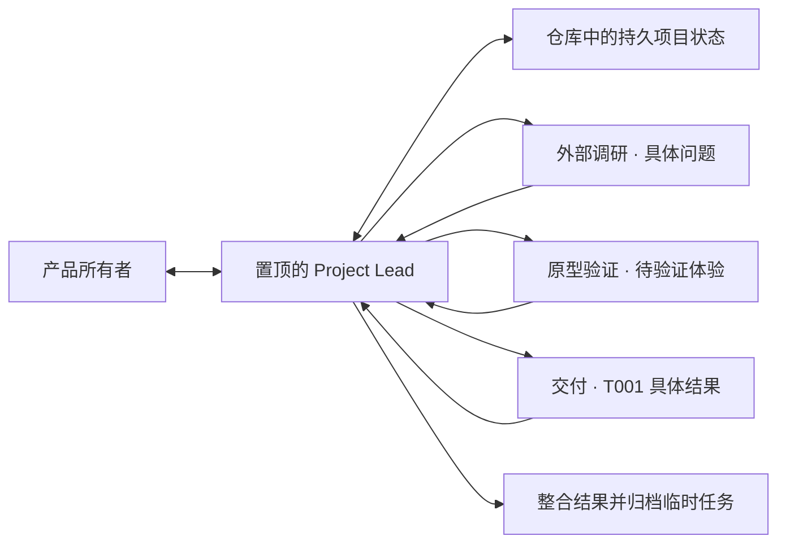

# Kann Workflows

**让资深产品构建者只负责产品判断，让 Codex 管理工程工作方式。**

Kann Workflows 是一个独立、开源、实验性的 Codex 插件与项目初始化器。
它面向懂产品、体验和基本软件边界，但不希望亲自管理 Skill 命令、会话编排、
Ticket 格式、Git 流程和工程角色的产品设计者与产品负责人。

用户始终从一个置顶的 **Project Lead（产品主理）** 开始。Project Lead 会在
目标具体后，按需创建带明确对象的外部调研、原型验证、诊断、审查或交付任务，
整合结果后再归档。初始化不会生成一排空的“部门窗口”。

> 当前版本：`0.7.0`。这是公开实验，不是成熟度认证，也不是任何上游项目的
> 官方发行版。

## 一分钟开始

### 只安装插件

在要使用 Kann 的 Codex 环境中运行：

```powershell
npx github:thevenomsnake/kann_workflows install
```

这条命令只添加 Kann marketplace 并安装插件，不创建项目、不初始化 Git、
不启动 Codex。适合先在现有项目或隔离实例中试用 Skills。

### 初始化一个新项目

在空文件夹中运行：

```powershell
npx github:thevenomsnake/kann_workflows init
```

也可以指定一个新的空目录：

```powershell
npx github:thevenomsnake/kann_workflows init ./my-product
```

初始化器会：

1. 安装 Kann Workflows 插件；
2. 创建最小的 `.ai-workflow/PROJECT.md` 与项目级 `AGENTS.md`；
3. 初始化 Git，并在本机已配置 Git 身份时创建首个提交；
4. 通过一次性 Codex App Server bridge 创建、命名并置顶 Project Lead；
5. 打开项目，然后退出 bridge，不常驻后台。

私有仓库安装需要本机 Git 已具备对应 GitHub 访问权限。初始化器只接受空目录，
不会接管或重写一个已有项目。

## 用户只需要说产品语言

例如：

```text
我想做一个帮助独立设计师管理客户反馈的工具。
```

也可以直接说：

- 帮我把这个产品想法讨论清楚；
- 先调研这个市场、竞品或外部限制；
- 做一个最小原型验证这个交互；
- 继续推进当前项目；
- 这个结果不符合预期，先找出原因。

默认路径不要求用户输入 `$to-spec`、`$research`、`$prototype` 或其他 Skill
命令。希望精确控制原始工作流的高级用户，仍然可以显式使用插件内保留的
Matt Pocock Skills 和 Ponytail 入口。

## 一个入口，按需开工作间



| Codex 任务 | 何时创建 | 生命周期 |
| --- | --- | --- |
| `<项目> · Project Lead` | 初始化时 | 默认长期存在并置顶 |
| 想法讨论 | 默认就在 Project Lead 中 | 不额外创建空任务 |
| `<项目> · 外部调研 · T### <具体问题>` | 外部事实可能改变产品决定时 | 结果整合后归档 |
| `<项目> · 原型 · T### <待验证体验>` | 必须实际体验才能决定时 | 验证完成后归档 |
| `<项目> · 诊断/审查 · T### <具体对象>` | 需要独立证据或验收时 | 收口后归档 |
| `<项目> · 交付 · T### <用户结果>` | 对应 Ticket 已获授权时 | 集成后归档 |
| 长期专业管理任务 | 确实形成独立持续队列时 | 才建立并置顶 |

任务必须带具体对象。`外部调研 · 用户为何放弃首次配置` 是工作，只有
`外部调研` 四个字则只是能力目录。只有独立产物、不同专业上下文、安全并行、
上下文压力、权限边界或独立验收真正存在时，Kann 才拆出新任务。

## Kann 管理什么

- 从自然语言建立产品方向、首个可观察价值和风险边界；
- 每次只把真正需要人的产品判断交给用户；
- 把事实、决策、角色、Ticket、授权和结果写入可版本化的项目状态；
- 根据证据自动选择讨论、领域建模、研究、原型、实现、诊断和审查方法；
- 为获批的具体工作创建、复用、等待和归档 Codex 原生任务；
- 默认交付最小可运行或可检查的纵向切片，并执行一次风险匹配的验证；
- 防止任务创建被误当成无限授权，发布、费用、账号、私有数据、破坏性操作和
  不可逆迁移仍需要明确边界。

Kann 不创建独立聊天界面、Dashboard、Launcher 功能或自定义任务面板。
Codex Desktop 是唯一用户界面；仓库是持久记忆，Codex 任务是可替换的注意力
工作区。

## 插件包含什么

插件当前提供 30 个 Skills：

- **Kann Workflows：2 个**
  - `project-lead`：唯一产品入口、自动能力路由和产品闭环；
  - `orchestrate-tickets`：内部的原生 Codex 任务执行与恢复能力。
- **Matt Pocock Skills：22 个**
  - 13 个保持上游的显式调用策略；
  - 9 个保持上游的模型自动调用策略。
- **Ponytail：6 个**
  - 同时包含其 Codex 会话启动、恢复、清空、压缩、模式切换和子任务继承所需
    的生命周期 hooks。

Kann 的 Project Lead 可以把已打包 Skill 的说明作为内部工作流参考。这是 Kann
自有的编排行为，不是 Matt 上游的自动调用行为；Matt Skill 在 Codex 注册层面的
13 个手动、9 个自动入口元数据保持不变，也不会把原本允许自动匹配的能力降级
为手动入口。

## Ponytail hooks

Ponytail 默认以 `full` 模式启动，仍支持原版的 `lite`、`full`、`ultra` 和
`off` 切换。

Codex 不会自动信任任何第三方插件 hook。首次安装或 hook 内容变化后，请在
Codex 中使用 `/hooks`，或当前界面提供的 hook review 入口，审阅并信任它们。
生命周期脚本还要求非交互命令环境的 `PATH` 中存在 Node.js 18 或更高版本。

未信任 hooks、禁用 hooks 或找不到 Node.js 时，30 个 Skills 仍然可用；只有
Ponytail 的自动激活、压缩后重注入和子任务继承不会运行。

## 对上游项目的尊重与说明

Kann Workflows 是独立项目。它直接包含两个 MIT 项目基于固定 commit 的
vendored 副本，并在许可范围内进行 Codex 宿主适配。我们感谢这些作者公开其
工作；如果这些方法对你有帮助，也请访问和支持原项目。

### Matt Pocock Skills

- 原项目：[mattpocock/skills](https://github.com/mattpocock/skills)
- 固定版本：`2ab958093e83e0ec752e6c1c5932da465bf23e0c`
- Kann 包含：22 个正式 Engineering 与 Productivity Skill 目录；
- Kann 适配：把分类目录展开到 Codex 插件的直接 `skills/` 子目录，并用
  `agents/openai.yaml` 表达 Codex 调用策略；原有 13 个手动、9 个自动分类保持
  不变。

### Ponytail

- 原项目：[DietrichGebert/ponytail](https://github.com/DietrichGebert/ponytail)
- 固定版本：`16f29800fd2681bdf24f3eb4ccffe38be3baec6b`
- Kann 包含：全部 6 个 Skills，以及 Codex 生命周期 hook 配置和所需脚本；
- Kann 适配：增加本地 CommonJS 边界、识别 Kann namespace，并把持久默认值
  隔离在当前插件的 `PLUGIN_DATA` 中。

完整的上游版权、MIT 许可文本、固定 commit 和修改边界见
[Third-Party Notices](THIRD_PARTY_NOTICES.md)。上游作者没有赞助、认可或背书
Kann Workflows；Kann 的问题也不代表上游项目的问题。

## 当前实现阶段

| 方法版本 | 包版本 | 已完成的纵向切片 |
| --- | --- | --- |
| V1 | `0.1.0` | 插件分发、空目录初始化、Git 与最小项目内核 |
| V1.5 | `0.2.0` | 自然语言入职、最少职责和首个有边界工作的持久化 |
| V2 | `0.3.0` | 首个 Project Lead bridge，以及原生任务创建、续发、等待和归档 |
| V3 | `0.4.0` | Codex Desktop 内从产品入职到工作集成与状态收口的机械闭环 |
| V3.1 | `0.5.0` | 统一 Ticket 真源，并将执行授权限定到明确 Ticket 集合 |
| V3.2 | `0.6.0` | 内置 Matt 22 个 Skills 与 Ponytail 6 个 Skills，保留 Matt 调用分类与 Ponytail 生命周期语义，并披露宿主适配 |
| V3.3 | `0.7.0` | 一个固定产品入口，按需创建具名调研、原型、诊断、审查和交付任务 |

`0.7.0` 继续使用 schema v2，只用于新初始化项目。初始化器不会静默批量
重写旧项目；旧工作重新进入活跃状态时，由 Project Lead 按当前 Ticket 契约
保守恢复。

## 研究与手册

本仓库同时公开 Kann 的研究、设计、实验和可复用手册：

- [多会话协作：用上下文隔离对抗注意力衰减](playbooks/multi-session-collaboration.md)
- [面向产品构建者的 Project Lead](playbooks/product-oriented-project-lead.md)
- [Codex 原生 Ticket 编排](playbooks/codex-ticket-orchestration.md)
- [Matt Pocock Skills 与 Ponytail 使用手册](playbooks/matt-skills-and-ponytail-guide.md)
- [安装与项目启动体验](design/installation-and-project-bootstrap.md)

目录说明：

- `research/`：外部项目与资料的观察记录；
- `design/`：仍在讨论和验证的产品设计；
- `experiences/`：真实任务中的实践与复盘；
- `experiments/`：公开安全、可重复的验证记录；
- `playbooks/`：跨项目可采用的协作手册；
- `plugins/kann-workflows/`：实际分发的 Codex 插件。

本仓库默认公开发布。请勿提交私人项目名、本机路径、会话或任务 ID、账号、
内部系统、密钥或可识别业务数据。私人实践只能贡献匿名化的方法和证据。

## License

Kann Workflows 自有代码和文档采用 [MIT License](LICENSE)。随插件分发的上游
部分保留各自原始版权与 MIT 许可声明，详见
[THIRD_PARTY_NOTICES.md](THIRD_PARTY_NOTICES.md)。
