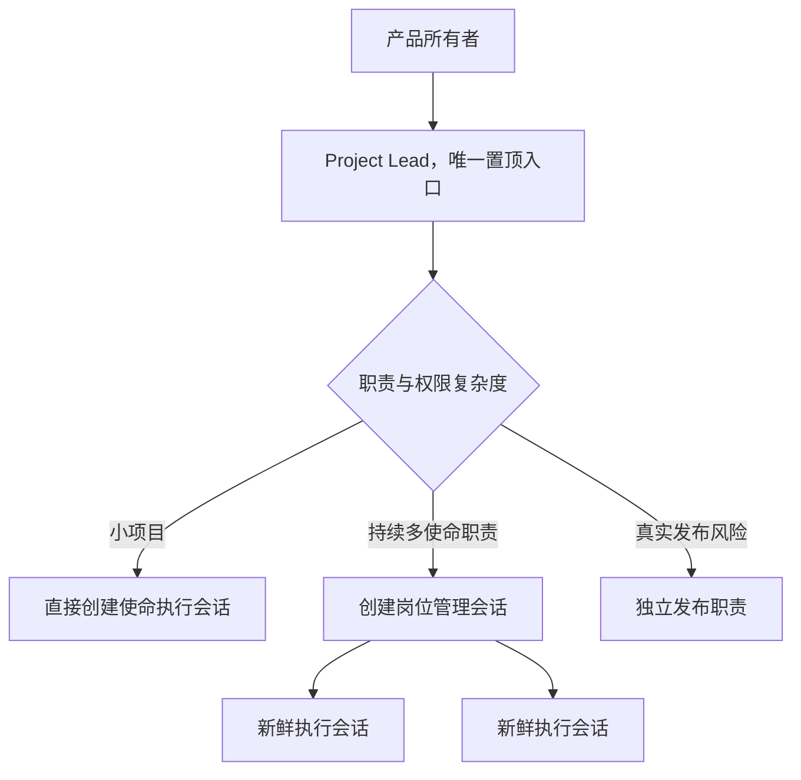

# 安装与项目启动体验

> 状态：递进实现中。本文同时记录目标体验、已验证能力和版本边界。

## 产品愿景

任何人都可以在一个空文件夹中运行一次安装或初始化命令。工具完成最低限度的项目准备，并在 Codex 中建立一个面向用户的项目负责人。用户随后只需用自然语言描述想做什么；系统负责理解目标、形成职责、规划使命、调用内部 skills、创建新鲜执行会话并收口结果。

正常使用路径不要求用户输入 skill、slash command、Git 命令或测试命令。

```text
空文件夹
  -> 一次初始化命令
  -> 安装或确认 AI Workflow 插件
  -> 初始化 Git 与最小项目内核
  -> 建立唯一项目入口
  -> 用户描述产品目标
  -> Project Lead 了解产品并形成职责方案
  -> 用户确认第一个产品范围
  -> 系统创建必要的管理与执行会话
  -> 交付可操作结果并持续迭代
```

## 核心修正

安装时可以提供完整能力，但不能在尚未理解项目时实例化一整套固定组织。

空目录无法告诉系统这是 Web 应用、自动化、研究、数据工作、文档还是其他项目。此时立即创建前端、后端、测试、研究和发布会话，会产生空岗位、模板噪声和错误的工程边界。

因此采用三个阶段：

1. **安装**：让完整插件能力在 Codex 中可用。
2. **项目启动**：在当前目录建立最小、可恢复的项目内核。
3. **产品入职**：Project Lead 了解目标后，按真实职责和权限形成角色与会话。

一条命令可以连续执行前两个阶段并尝试打开第三阶段，但概念和失败恢复必须保持分离。

## 最小项目内核

初始化时只创建真正跨项目通用的内容：

```text
AGENTS.md
.ai-workflow/
└── PROJECT.md
.gitignore
.git/
```

`PROJECT.md` 初始保存：

- 初始化状态与工具版本；
- 尚待了解的产品方向；
- 当前 Project Lead 的稳定名称；
- 用户是否授权本轮创建同项目 Codex 任务；
- 当前状态及后续持久工件入口。

角色、使命、决策和归档目录按需创建。不得为了看起来完整而生成空文档树。

项目已有同类文件时复用原结构，不并行建立第二套项目管理系统。所有项目文件、缓存和临时产物必须留在项目根目录内。

## 首次产品对话

初始化后，用户看到的唯一入口应是：

```text
<项目名> · 项目负责人
```

Project Lead 首先理解：

- 谁会使用结果；
- 要解决什么问题；
- 第一个可感知价值是什么；
- 是否涉及账号、费用、隐私、外部服务或发布；
- 什么结果可以直接预览、运行或检查。

它只询问真正改变产品方向的问题。框架、分支、测试工具、模型和内部 skills 由系统选择。

## 自适应岗位深度

岗位不是安装模板，而是产品理解的结果。



小项目不需要岗位管理层。Project Lead 可以直接把一项使命交给一个新鲜执行会话。

只有当某个职责持续接收多项使命、维护独立专业上下文、拥有不同写入范围，或具有独立权限时，才创建岗位管理会话。执行会话完成使命后归档；岗位职责继续存在于仓库，而不是依赖长期聊天。

## 建议产品形态

最终交付物不应只是若干独立 skills，而应是一个可安装插件加一个项目初始化器：

```text
AI Workflow Plugin
├── project-lead
├── orchestrate-tickets
├── bootstrap-project
├── research / prototype / diagnosis / review 等内部能力
├── 最小项目模板
├── 初始化 CLI
└── 可选任务管理工具
```

优先从 skills-only 插件开始。现有 Codex 项目任务工具足以支持活跃 Project Lead 创建、发送、等待和归档同项目任务；只有缺少稳定能力时才增加 MCP server。Hooks 只用于生命周期约束或上下文恢复，不负责静默创建一批会话。

## 当前已确认的事实

- Codex 插件可以打包一个或多个 skills，也可按需加入 MCP server、hooks 和 UI。
- 插件安装后，需要在新会话中使用新安装的能力。
- Codex 项目用于组织共享同一文件上下文的多个会话；官方建议每个独立结果使用独立会话。
- 当前 Codex App 环境已经实测可以由活跃任务创建同项目任务、发送消息、等待结果和归档。
- Codex App Server 提供 `thread/start`、`thread/list`、`thread/read` 和 `thread/archive` 等程序化接口。

来源：[Plugins](https://learn.chatgpt.com/docs/plugins) · [Projects and chats](https://learn.chatgpt.com/docs/projects) · [Codex App Server](https://learn.chatgpt.com/docs/app-server)

## 已确立的任务注入能力

同项目 Codex 任务可以被创建并命名，也可以继续接收消息、等待结果和归档；这些任务会成为用户可见的项目任务。我们已经通过实际协作反复验证这条链路，因此它是产品能力，不再作为待论证假设。

版本差异只在于谁发起这条链路：V1 由用户打开项目后的 Project Lead 发起；V2 由初始化器直接建立首个 Project Lead，并由它继续注入获批的职责和使命任务。

## 建议迭代路线

### V1：可安装内核

- 把现有 skills 包装成 skills-only Codex 插件；
- 提供空目录初始化命令；
- 生成最小项目内核并初始化 Git；
- 用户在 Codex 中打开目录并启动一次 Project Lead；
- Project Lead 在一次授权后创建后续任务。

### V1.5：完整项目入职

- Project Lead 自动识别交付类型；
- 形成最少角色和第一个使命；
- 管理岗位会话、执行会话、当前状态和归档；
- 用户始终通过一个项目入口继续修改产品。

### V2：自动建立首个入口

- 初始化器创建并命名同项目 Project Lead；
- 向已创建任务发送项目入口与启动消息；
- 管理等待、续发、完成与归档，不要求用户手工调度会话。

### V3：独立启动器/客户端

在原生 Codex 任务能力之上提供一个更完整的项目入口，让用户初始化、描述目标、查看职责与使命状态，而不需要理解 App Server 或任务工具。

## 待讨论问题

1. 第一个公开版本优先支持哪类项目，以及它的验收载体是什么。
2. 初始化命令采用哪种跨平台分发方式。
3. 插件是用户全局安装一次，还是由每个项目记录并检查所需版本。
4. 用户如何授予和撤销“为本项目自动创建 Codex 任务”的权限。
5. 什么规模或职责条件触发岗位管理会话，而不是直接创建执行会话。
6. Project Lead 的唯一入口是否应默认置顶，以及归档策略如何与用户已有侧边栏习惯共存。
