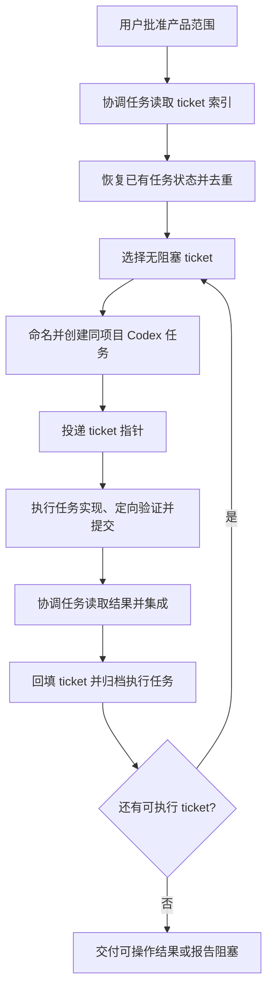

# Codex 原生 Ticket 编排

> 状态：MAGA 0.9.0 内部编排流程。上游 `to-tickets` 与 `implement`
> 的工作方法已保留在插件内部，不再作为需要用户选择的 Skill 入口。

## 改造目标

Matt Skills 已经定义了一个有效边界：ticket 写清以后，应交给只围绕该 ticket 工作的新鲜实现会话。但上游流程需要人手动打开新会话并选择实现入口，没有负责创建会话、投递任务和等待结果。

Codex 已经提供项目任务、worktree、消息发送和任务等待能力，因此这段人工操作由 MAGA 的 Project Lead、内部方法与 Ticket 编排 Skill 接管。用户不需要记住上游入口名或任何 slash command；他只需要批准产品范围并要求开始执行。



## 用户如何触发

不需要显式选择 skill。自然语言只需确认当前 Ticket 集合已经批准并可以开始执行。例如：

```text
这个拆分可以，按这些 Tickets 开始执行。
```

```text
继续推进已经批准、没有阻塞的任务。
```

这不是要求用户学习内部命令，而是确认系统可以开始执行。一次批准覆盖本轮已明确描述的 Ticket 集合，并分别写入每张 Ticket 的 `authorization: approved`；不应在每张 Ticket 或每个 worker 前重复询问，也不得把批准延伸到未来新增或实质扩大的 Ticket。是否创建独立任务由系统根据注意力和权限边界内部决定。

## 内部职责

协调任务负责：

- 维护产品目标、ticket 依赖和完成判断；
- 找到当前无阻塞的 ticket；
- 创建同项目任务并等待结果；
- 将真正需要人的产品决定带回主对话；
- 按依赖顺序集成提交。

执行任务负责：

- 读取 `AGENTS.md`、当前 ticket 及其明确引用；
- 在 ticket 边界内完成最短可运行纵向切片；
- 运行一次风险匹配的定向验证；
- 提交并返回行为、验证事实、commit 或阻塞原因。

执行任务不能继续拆分或创建其他任务，也不能宣布整个产品已经完成。ticket 状态、结果集成和下游释放只由协调任务收口。

## 任务命名

名称需要同时服务于人类浏览和协调任务恢复，不能只写一个含糊的 “Implement ticket”。采用确定性格式：

```text
协调任务：<项目名> · 项目负责人
执行任务：<项目名> · <职责> · <Ticket 编号> <用户结果>
替代任务：<原执行任务名> · 重试 <次数>
```

例如：

```text
库存管理 · 项目负责人
库存管理 · 库存体验 · 02 记录库存变动
库存管理 · 库存体验 · 03 查看低库存商品
```

标题使用项目本身的语言。职责来自持久角色契约，不机械使用“前端”“后端”等代码层名称。标题保留稳定的 Ticket 编号，但不包含状态、thread ID、分支、worktree 或 commit。状态变化不重命名任务；只有原任务不可继续、确实创建替代任务时才增加重试次数。

同一个 ticket 同时只能有一个活动任务。创建前必须按确定性名称检查现有 Codex 任务，不能把“暂时没有返回结果”误判成“任务不存在”。

## 两层状态

ticket 是可恢复的持久真源，至少保存：

```text
Authorization: pending | approved | revoked
Status: ready | creating | running | needs-decision | completed | integrated | failed | deferred
Task title: <确定性名称>
Attempt: <正整数>
Result commit: <完成后填写>
Validation: <完成后填写>
Blocker: <阻塞或失败时填写>
```

Codex 任务自身有另一条运行时生命周期：

```text
creating -> running -> completed -> archived
                <-> needs-decision
creating/running -> failed
failed/running -> superseded -> archived
```

两者不能混为一谈：

- 只有 `authorization: approved` 的 Ticket 才能进入执行 frontier；
- 是否创建新 Codex 任务只是内部执行选择，不是另一项用户权限；
- `completed` 只表示执行任务已经产生 commit；
- `integrated` 表示该 commit 已进入目标分支；
- 下游 ticket 只在 blocker `integrated` 后释放；
- `archived` 是 Codex 任务清理动作，不会覆盖 ticket 的集成记录。

thread ID、host ID、client thread ID、等待 cursor 和 worktree 位置只属于 Codex 运行时，不得提交仓库。仓库保留确定性任务名称、尝试次数、结果 commit 和验证事实，足以让新协调会话重建关系。

如果 ticket 是仓库文件，而 worker 与协调任务共享同一个 checkout，`creating` 在整个执行期间同时承担持久 claim。此时 `running` 只存在于 Codex 运行时；协调任务不得为了更新状态与 worker 并发编辑或提交。worker 停止后再一次性回填完成状态。

## 创建会话

协调任务先用 Codex 项目列表确认当前项目，再把 Ticket 状态设为 `creating`，然后创建带有确定性标题的同项目任务。仓库规则允许 worktree 所在位置时才使用独立 worktree；如果项目内容必须留在原项目目录，则所有写入任务使用该目录并严格串行。Ticket 必须已经存在于新任务能读取的仓库状态或远程 tracker 中。

创建 worktree 是异步过程。Codex 可能立即返回可操作的 `threadId`，也可能先返回 `clientThreadId`：

- 得到 `threadId` 后，运行时任务进入 `running`；tracker 能在不触碰 worker checkout 的情况下更新时，ticket 也进入 `running`；
- file-backed tracker 与 worker 共用 checkout 时，ticket 保持 `creating`，协调任务保持只读；
- 只有 `clientThreadId` 时保持 `creating`；
- `clientThreadId` 不能用于发送消息、读取、等待或归档；
- 后续通过确定性标题在项目任务列表中找到正式任务；
- 创建中的任务不能因为短暂查不到就重复创建。

启动消息只包含 ticket 指针和稳定执行规则。执行任务的最终输出固定为状态、用户行为、验证事实、commit 和阻塞，避免协调任务从自由叙述中猜测是否完成。

## 管理与恢复

协调任务每次启动或恢复时先对账，再创建新任务：

1. 读取所有非终态 tickets。
2. 列出任务，并按当前项目、主机和确定性标题匹配。
3. 已有活动任务则继续等待，不重复投递。
4. 已完成但未集成的任务优先收口。
5. 已集成但未归档的任务完成归档。
6. 发现重复执行任务时，只保留当前尝试，将其余记录为 `superseded` 后归档。

状态为 `creating` 但暂时没有正式 task 的情况只做一次有边界的刷新。确认创建失败后，先记录失败尝试，再创建带重试编号的替代任务。

任务需要产品决定时进入 `needs-decision`。协调任务把问题转换成产品语言询问用户，把答案先写回 ticket 或决策记录，再向原执行任务发送后续消息。能够继续的任务不新建替代会话。

只有原任务上下文或 worktree 已不可用时才创建替代任务。替代任务读取原 ticket 和必要的持久失败事实，不继承整段失败聊天。

## 完成与归档

执行任务返回 `completed` 后，协调任务依次进行：

1. 确认 commit 可解析，且包含具体的定向验证事实。
2. 把 ticket 设为 `completed`，记录 worker commit 与验证。
3. 按项目既有 Git 流程集成提交。
4. 集成成功后把 ticket 设为 `integrated`，再释放下游。
5. 持久记录完整后归档执行任务。

worker 直接使用目标 checkout 时，它的 commit 已经位于目标分支，不得再次 cherry-pick；协调任务只需核对提交身份和变更边界。归档前不能只依赖执行任务聊天保存结果。失败优先在原任务中定向修复，不自动制造多个竞争实现。

## 什么隐藏，什么保留

对用户隐藏：skill 名称、ticket 调度、worktree、测试工具、会话 ID 和 Git 集成细节。

必须让用户判断：产品行为歧义、费用、外部账号与权限、敏感数据、不可逆操作、发布，以及系统无法验证的结果。

用户仍可以在 Codex 中打开执行任务查看过程。这里的“隐藏”表示不要求用户操作或理解工程机制，不表示系统掩盖状态、风险或结果。

## 上下文边界

新任务收到的是 ticket 路径或 Issue URL，而不是完整规划聊天。ticket 是需求真源；启动消息只补充稳定的执行策略。

“只读取当前 ticket”不是文件权限隔离。执行任务仍可读取完成该 ticket 必需的代码、项目规则和直接依赖，但不应预加载全部 tickets 或重新讨论已经批准的产品范围。

## 调度边界

- 单个小任务留在当前会话，避免为了形式创建新任务。
- 默认串行执行；只有依赖独立、写入边界不冲突、仓库规则允许且使用独立 worktree 时才并行。
- ticket 必须先成为执行任务能读取的持久工件，不能只存在于协调聊天。
- thread ID、本机路径等运行时信息不得写入公开仓库。
- 不一次性创建全部 tickets，只领取当前 frontier 和可管理容量内的任务。
- 第一版不自动选择 TDD、全量回归或双轴 review；采用仓库规则和 ticket 要求的最窄验证。

## 当前产物

可安装 skill 位于 [`orchestrate-tickets`](../plugins/maga/skills/orchestrate-tickets/SKILL.md)。它是内部执行能力；面向产品构建者的入口是 [`project-lead`](../plugins/maga/skills/project-lead/SKILL.md) 和自然语言。

下一步应使用一组无隐私内容的示例 tickets 做真实 Codex 任务投递，观察 ticket 粒度、阻塞返回和提交集成是否足够稳定，再决定是否把需求澄清与自动拆票并入同一入口。
