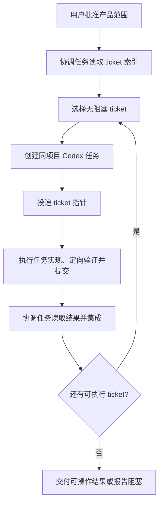

# Codex 原生 Ticket 编排

> 状态：第一版实验流程。它改造的是 Matt Skills 从 `to-tickets` 到 `implement` 之间仍需人工操作的部分。

## 改造目标

Matt Skills 已经定义了一个有效边界：ticket 写清以后，应交给只围绕该 ticket 工作的新鲜实现会话。但上游只要求人“打开新会话并调用 implement”，没有负责创建会话、投递任务和等待结果。

Codex 已经提供项目任务、worktree、消息发送和任务等待能力，因此这段人工操作可以被内部 skill 接管。用户不需要记住 `to-tickets`、`implement` 或任何 slash command；他只需要批准产品范围并要求开始执行。



## 用户如何触发

不需要显式选择 skill。自然语言中需要包含两个事实：范围已经批准，并且允许 Codex 使用独立任务执行。例如：

```text
这个拆分可以，按这些 tickets 创建独立任务开始执行。
```

```text
继续推进已经批准、没有阻塞的任务。
```

这不是要求用户学习内部命令，而是确认系统可以开始产生代码和创建任务。一次批准覆盖本轮已确认的 ticket 集合；不应在每张 ticket 前重复询问。

## 内部职责

协调任务负责：

- 维护产品目标、ticket 依赖和完成判断；
- 找到当前无阻塞的 ticket；
- 创建同项目任务并等待结果；
- 将真正需要人的产品决定带回主对话；
- 按依赖顺序集成提交。

执行任务负责：

- 读取 `AGENTS.md`、当前 ticket 及其明确引用；
- 在 ticket 边界内完成最短可运行纵向切片；
- 运行一次风险匹配的定向验证；
- 提交并返回行为、验证事实、commit 或阻塞原因。

## 什么隐藏，什么保留

对用户隐藏：skill 名称、ticket 调度、worktree、测试工具、会话 ID 和 Git 集成细节。

必须让用户判断：产品行为歧义、费用、外部账号与权限、敏感数据、不可逆操作、发布，以及系统无法验证的结果。

用户仍可以在 Codex 中打开执行任务查看过程。这里的“隐藏”表示不要求用户操作或理解工程机制，不表示系统掩盖状态、风险或结果。

## 上下文边界

新任务收到的是 ticket 路径或 Issue URL，而不是完整规划聊天。ticket 是需求真源；启动消息只补充稳定的执行策略。

“只读取当前 ticket”不是文件权限隔离。执行任务仍可读取完成该 ticket 必需的代码、项目规则和直接依赖，但不应预加载全部 tickets 或重新讨论已经批准的产品范围。

## 调度边界

- 单个小任务留在当前会话，避免为了形式创建新任务。
- 默认串行执行；只有依赖独立、写入边界不冲突且使用独立 worktree 时才并行。
- ticket 必须先成为执行任务能读取的持久工件，不能只存在于协调聊天。
- thread ID、本机路径等运行时信息不得写入公开仓库。
- 第一版不自动选择 TDD、全量回归或双轴 review；采用仓库规则和 ticket 要求的最窄验证。

## 当前产物

可安装 skill 位于 [`skills/orchestrate-tickets`](../skills/orchestrate-tickets/SKILL.md)。它是内部能力入口，面向产品构建者的正常路径仍然是自然语言。

下一步应使用一组无隐私内容的示例 tickets 做真实 Codex 任务投递，观察 ticket 粒度、阻塞返回和提交集成是否足够稳定，再决定是否把需求澄清与自动拆票并入同一入口。
