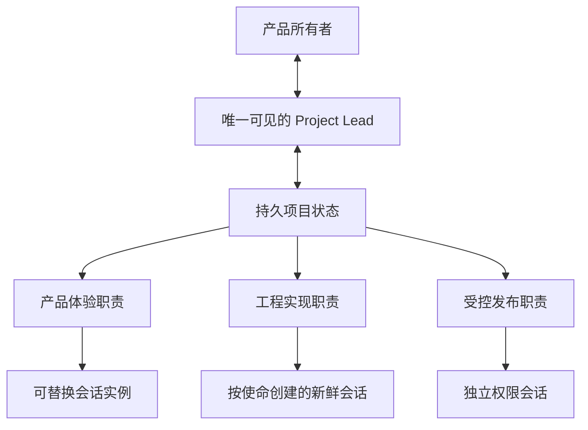

# 面向产品构建者的 Project Lead

## 结论

产品构建者不应该管理研发阶段、skill 命令和执行会话。他需要一个持续可进入的项目负责人：理解产品目标，只询问真正需要人的产品决定，并在内部组织职责、使命、能力和 Codex 会话。

这里的“负责人”不是替用户做主，也不是一个永不结束的万能会话。它是一个可由新会话恢复的长期职责，最终产品权力仍属于用户。



## 四种构件

| 构件 | 回答的问题 | 生命周期 |
| --- | --- | --- |
| 角色 | 谁长期负责什么，拥有什么权限 | 长期存在，可调整 |
| 使命 | 这一次要交付哪个产品结果 | 完成、阻塞或放弃后结束 |
| 会话实例 | 这次由哪个注意力工作区承担使命 | 可随时替换 |
| 能力 | 完成工作时采用哪种方法 | 按需加载 |

因此，研究、原型、TDD、review、Ponytail 或视觉审查通常只是能力。只有当它们拥有长期上下文、独立产物或不同权限时，才需要形成角色。

## 用户体验

用户可以直接说：

```text
做一个供小团队使用的库存管理工具，手机上也要方便操作。
```

Project Lead 可以询问：

- 库存由一人维护还是多人共同维护？
- 出库后是否允许撤销？
- 哪个操作最值得先做成可体验版本？

它不应询问：

- 是否调用某个 skill；
- 是否使用 TDD 或双轴 review；
- 前后端如何拆 ticket；
- 使用哪个分支、worktree 或模型。

技术选择只有在明显改变产品体验、成本、数据风险或可逆性时，才转换成产品语言交给用户判断。

## 岗位如何形成

默认只有 Project Lead。只有出现真实边界时才增加角色：

1. 专业上下文明显不同；
2. 持久产物或写入范围不同；
3. 权限、副作用或发布风险不同；
4. 需要独立验收或责任制衡。

角色不应机械等于前端、后端、测试或研究。一个小型 Web 产品可能只需要 Project Lead 与一个产品实现角色；具有生产环境时再增加受控发布角色。一个研究项目则可能形成来源研究与编辑收口职责，而没有任何前后端岗位。

## 岗位稳定，会话可换

角色契约至少说明：存在目的、拥有和不拥有的范围、最小启动上下文、输出、权限与需要用户批准的动作。

会话实例只承担一个内聚使命。使命变化、上下文混入无关历史、权限改变，或从持久状态重新加载更便宜时，就替换会话。不得依赖永久任务保存岗位记忆，也不得把本机 task ID 提交到仓库。

执行任务名称应同时体现角色和本次使命：

```text
<项目> · <职责> · <使命编号> <用户结果>
```

## 项目大脑保持分层

文件名可以服从现有仓库，但逻辑上需要区分：

- 产品方向：稳定目标与用户；
- 当前状态：现在可用、进行中和阻塞；
- 角色注册：职责、边界和权限；
- 使命契约：结果、验收、阻塞与证据；
- 决策记录：少量重要且难逆的选择；
- 历史归档：已经完成的过程。

不要把这些内容不断追加进一个巨大的 handoff。新 Project Lead 应先读取稳定入口和当前状态，再按指针打开当前使命；完成历史默认不进入工作集。

## 与 Skills 的关系

`project-lead` 是产品入口和角色编排层。它根据事实选择研究、领域建模、原型、最小实现、诊断、视觉审查等能力，不要求用户知道调用过程。

`orchestrate-tickets` 是更低一层的 Codex 任务运行时：在使命已经批准后创建、等待、恢复和归档执行会话。它不负责决定产品方向，也不应该继续膨胀成项目负责人。

Matt Skills 中的 spec、tickets 和 implement 可以作为内部方法继续吸收，但显式阶段、强制工程术语和默认重验证不再构成用户路径。

## 第一版边界

当前版本先定义产品交互、角色形成、使命契约和执行层关系，不建立数据库、组织图编辑器或统一文件格式。真实项目应优先复用现有文档与 tracker。

下一步验证应从一句自然语言产品目标开始，观察 Project Lead 是否只提出产品问题、能否形成最少角色，并在不要求用户选择 skill 的情况下交付第一个可操作结果。
